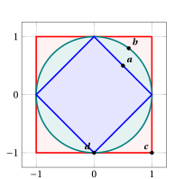

# Norms

**Exercises · Norms** · chapter [5 · Norms](../norms/01-norms.md) · with worked solutions · [:material-file-pdf-box: PDF](../pdf/es-norms-01-norms.pdf)

!!! esercizio "Exercise 1"

    Compute the \(\ell_1\), \(\ell_2\) and \(\ell_\infty\) norms of the following column vectors:

    $$
    {\boldsymbol p} = \begin{pmatrix} 2 \\ -3 \\ 6 \end{pmatrix} \in \R^3,
    \qquad
    {\boldsymbol w} = \begin{pmatrix} 4 \\ 0 \\ -3 \end{pmatrix} \in \R^3,
    \qquad
    {\boldsymbol u} = \begin{pmatrix} 1 \\ -1 \\ 1 \\ -1 \end{pmatrix} \in \R^4
    $$

    For each vector, check that \(\|\cdot\|_\infty \le \|\cdot\|_2 \le \|\cdot\|_1\).

??? soluzione "Solution"

    Using the definitions, we have:

    \begin{align*}
    &\|{\boldsymbol p}\|_1 = |2| + |-3| + |6| = 11, &&
    \|{\boldsymbol p}\|_2 = \sqrt{4 + 9 + 36} = 7, &&
    \|{\boldsymbol p}\|_\infty = \max\{2, 3, 6\} = 6 \\[1ex]
    &\|{\boldsymbol w}\|_1 = |4| + |0| + |-3| = 7, &&
    \|{\boldsymbol w}\|_2 = \sqrt{16 + 0 + 9} = 5, &&
    \|{\boldsymbol w}\|_\infty = \max\{4, 0, 3\} = 4 \\[1ex]
    &\|{\boldsymbol u}\|_1 = 1 + 1 + 1 + 1 = 4, &&
    \|{\boldsymbol u}\|_2 = \sqrt{1 + 1 + 1 + 1} = 2, &&
    \|{\boldsymbol u}\|_\infty = \max\{1, 1, 1, 1\} = 1
    \end{align*}

    Accordingly:

    $$
    6 \le 7 \le 11, \qquad 4 \le 5 \le 7, \qquad 1 \le 2 \le 4
    $$

!!! esercizio "Exercise 2"

    Consider the column vectors

    $$
    {\boldsymbol p} = \begin{pmatrix} 1 \\ 2 \\ -1 \end{pmatrix} \in \R^3
    \qquad \text{and} \qquad
    {\boldsymbol w} = \begin{pmatrix} 3 \\ -1 \\ 5 \end{pmatrix} \in \R^3
    $$

    Compute the distance between \({\boldsymbol p}\) and \({\boldsymbol w}\) measured with the \(\ell_1\), \(\ell_2\) and \(\ell_\infty\) norms, i.e., \(\|{\boldsymbol p} - {\boldsymbol w}\|_1\), \(\|{\boldsymbol p} - {\boldsymbol w}\|_2\) and \(\|{\boldsymbol p} - {\boldsymbol w}\|_\infty\). Then explain why \(\|{\boldsymbol w} - {\boldsymbol p}\| = \|{\boldsymbol p} - {\boldsymbol w}\|\) for every norm.

??? soluzione "Solution"

    The difference of the two vectors is

    $$
    {\boldsymbol p} - {\boldsymbol w} = \begin{pmatrix} 1 - 3 \\ 2 - (-1) \\ -1 - 5 \end{pmatrix} = \begin{pmatrix} -2 \\ 3 \\ -6 \end{pmatrix}
    $$

    hence:

    $$
    \|{\boldsymbol p} - {\boldsymbol w}\|_1 = 2 + 3 + 6 = 11, \quad
    \|{\boldsymbol p} - {\boldsymbol w}\|_2 = \sqrt{4 + 9 + 36} = 7, \quad
    \|{\boldsymbol p} - {\boldsymbol w}\|_\infty = \max\{2, 3, 6\} = 6
    $$

    Since \({\boldsymbol w} - {\boldsymbol p} = (-1) \, ({\boldsymbol p} - {\boldsymbol w})\), by absolute homogeneity (with \(\lambda = -1\)) we get, for every norm,

    $$
    \|{\boldsymbol w} - {\boldsymbol p}\| = |-1| \; \|{\boldsymbol p} - {\boldsymbol w}\| = \|{\boldsymbol p} - {\boldsymbol w}\|
    $$

!!! esercizio "Exercise 3"

    Consider the column vector

    $$
    {\boldsymbol p} = \begin{pmatrix} 2 \\ -1 \\ 2 \end{pmatrix} \in \R^3
    $$

    1. Find the vector \({\boldsymbol u}\) with the same direction and orientation as \({\boldsymbol p}\) such that \(\|{\boldsymbol u}\|_2 = 1\) (i.e., normalize \({\boldsymbol p}\) with respect to the \(\ell_2\) norm), and check the result.

    2. Normalize \({\boldsymbol p}\) with respect to the \(\ell_1\) norm and with respect to the \(\ell_\infty\) norm.

    3. Explain why the zero vector cannot be normalized.

??? soluzione "Solution"

    1. We have \(\|{\boldsymbol p}\|_2 = \sqrt{4 + 1 + 4} = 3\). For any norm, the vector \({\boldsymbol u} = \frac{1}{\|{\boldsymbol p}\|} \, {\boldsymbol p}\) has, by absolute homogeneity, \(\|{\boldsymbol u}\| = \frac{1}{\|{\boldsymbol p}\|} \|{\boldsymbol p}\| = 1\). Hence

        $$
        {\boldsymbol u} = \frac{1}{3} \begin{pmatrix} 2 \\ -1 \\ 2 \end{pmatrix} = \begin{pmatrix} \frac{2}{3} \\[0.5ex] -\frac{1}{3} \\[0.5ex] \frac{2}{3} \end{pmatrix},
        \qquad
        \|{\boldsymbol u}\|_2 = \sqrt{\frac{4}{9} + \frac{1}{9} + \frac{4}{9}} = \sqrt{1} = 1
        $$

    2. We have \(\|{\boldsymbol p}\|_1 = 2 + 1 + 2 = 5\) and \(\|{\boldsymbol p}\|_\infty = 2\), hence

        $$
        \frac{1}{5} \, {\boldsymbol p} = \begin{pmatrix} \frac{2}{5} \\[0.5ex] -\frac{1}{5} \\[0.5ex] \frac{2}{5} \end{pmatrix}, \quad \left\|\frac{1}{5} \, {\boldsymbol p}\right\|_1 = \frac{2}{5} + \frac{1}{5} + \frac{2}{5} = 1,
        \qquad
        \frac{1}{2} \, {\boldsymbol p} = \begin{pmatrix} 1 \\[0.5ex] -\frac{1}{2} \\[0.5ex] 1 \end{pmatrix}, \quad \left\|\frac{1}{2} \, {\boldsymbol p}\right\|_\infty = 1
        $$

    3. By definiteness, \(\|{\boldsymbol 0}\| = 0\), so we cannot divide by it. Moreover, \(\|\lambda \, {\boldsymbol 0}\| = \|{\boldsymbol 0}\| = 0 \neq 1\) for every \(\lambda \in \R\).

!!! esercizio "Exercise 4"

    Consider the column vectors

    $$
    {\boldsymbol p} = \begin{pmatrix} 1 \\ 2 \\ 2 \end{pmatrix} \in \R^3
    \qquad \text{and} \qquad
    {\boldsymbol w} = \begin{pmatrix} 2 \\ -2 \\ 1 \end{pmatrix} \in \R^3
    $$

    1. Verify the triangle inequality \(\|{\boldsymbol p} + {\boldsymbol w}\| \le \|{\boldsymbol p}\| + \|{\boldsymbol w}\|\) for the \(\ell_1\), \(\ell_2\) and \(\ell_\infty\) norms.

    2. Verify the reverse triangle inequality \(\big|\|{\boldsymbol p}\|_2 - \|{\boldsymbol w}\|_2\big| \le \|{\boldsymbol p} - {\boldsymbol w}\|_2\).

??? soluzione "Solution"

    We have

    $$
    {\boldsymbol p} + {\boldsymbol w} = \begin{pmatrix} 3 \\ 0 \\ 3 \end{pmatrix},
    \qquad
    {\boldsymbol p} - {\boldsymbol w} = \begin{pmatrix} -1 \\ 4 \\ 1 \end{pmatrix}
    $$

    1. - \(\ell_1\): \(\|{\boldsymbol p}\|_1 = 5\), \(\|{\boldsymbol w}\|_1 = 5\), \(\|{\boldsymbol p} + {\boldsymbol w}\|_1 = 6\), and \(6 \le 5 + 5 = 10\).

        - \(\ell_2\): \(\|{\boldsymbol p}\|_2 = \sqrt{1 + 4 + 4} = 3\), \(\|{\boldsymbol w}\|_2 = \sqrt{4 + 4 + 1} = 3\), \(\|{\boldsymbol p} + {\boldsymbol w}\|_2 = \sqrt{9 + 0 + 9} = 3\sqrt{2} \approx 4.243\), and \(3\sqrt{2} \le 3 + 3 = 6\).

        - \(\ell_\infty\): \(\|{\boldsymbol p}\|_\infty = 2\), \(\|{\boldsymbol w}\|_\infty = 2\), \(\|{\boldsymbol p} + {\boldsymbol w}\|_\infty = 3\), and \(3 \le 2 + 2 = 4\).

    2. \(\|{\boldsymbol p} - {\boldsymbol w}\|_2 = \sqrt{1 + 16 + 1} = \sqrt{18} = 3\sqrt{2}\), and

        $$
        \big|\|{\boldsymbol p}\|_2 - \|{\boldsymbol w}\|_2\big| = |3 - 3| = 0 \le 3\sqrt{2}
        $$

!!! esercizio "Exercise 5"

    Consider the column vectors

    $$
    {\boldsymbol p} = \begin{pmatrix} 1 \\ 2 \\ 3 \end{pmatrix},
    \qquad
    {\boldsymbol w} = \begin{pmatrix} 4 \\ -5 \\ 6 \end{pmatrix},
    \qquad
    {\boldsymbol u} = \begin{pmatrix} -2 \\ -4 \\ -6 \end{pmatrix}
    $$

    Verify the Cauchy–Schwarz inequality \(|{\boldsymbol p}' \, {\boldsymbol w}| \le \|{\boldsymbol p}\|_2 \, \|{\boldsymbol w}\|_2\) for the pair \({\boldsymbol p}, {\boldsymbol w}\) and for the pair \({\boldsymbol p}, {\boldsymbol u}\). In which case does equality hold?

??? soluzione "Solution"

    We have \(\|{\boldsymbol p}\|_2 = \sqrt{1 + 4 + 9} = \sqrt{14}\).

    - Pair \({\boldsymbol p}, {\boldsymbol w}\): \({\boldsymbol p}' \, {\boldsymbol w} = 4 - 10 + 18 = 12\) and \(\|{\boldsymbol w}\|_2 = \sqrt{16 + 25 + 36} = \sqrt{77}\), hence

        $$
        |{\boldsymbol p}' \, {\boldsymbol w}| = 12 \le \sqrt{14} \, \sqrt{77} = \sqrt{1078} \approx 32.83
        $$

        The inequality is strict.

    - Pair \({\boldsymbol p}, {\boldsymbol u}\): \({\boldsymbol p}' \, {\boldsymbol u} = -2 - 8 - 18 = -28\) and \(\|{\boldsymbol u}\|_2 = \sqrt{4 + 16 + 36} = \sqrt{56} = 2\sqrt{14}\), hence

        $$
        |{\boldsymbol p}' \, {\boldsymbol u}| = 28 = \sqrt{14} \cdot 2\sqrt{14} = \|{\boldsymbol p}\|_2 \, \|{\boldsymbol u}\|_2
        $$

        Equality holds: indeed \({\boldsymbol u} = -2 \, {\boldsymbol p}\), i.e., \({\boldsymbol u}\) is a scalar multiple of \({\boldsymbol p}\).

!!! esercizio "Exercise 6"

    Consider the points of \(\R^2\)

    $$
    {\boldsymbol a} = \begin{pmatrix} \frac{1}{2} \\[0.5ex] \frac{1}{2} \end{pmatrix},
    \qquad
    {\boldsymbol b} = \begin{pmatrix} \frac{3}{5} \\[0.5ex] \frac{4}{5} \end{pmatrix},
    \qquad
    {\boldsymbol c} = \begin{pmatrix} 1 \\[0.5ex] -1 \end{pmatrix},
    \qquad
    {\boldsymbol d} = \begin{pmatrix} 0 \\[0.5ex] -1 \end{pmatrix}
    $$

    1. Describe and sketch the unit balls \(\{{\boldsymbol x} \in \R^2 : \|{\boldsymbol x}\| \le 1\}\) of the \(\ell_1\), \(\ell_2\) and \(\ell_\infty\) norms.

    2. For each point, establish whether it lies inside, on the boundary, or outside each of the three unit balls.

??? soluzione "Solution"

    1. The \(\ell_1\) unit ball \(|x_1| + |x_2| \le 1\) is a diamond (a square rotated by 45°) with vertices \((\pm 1, 0)\) and \((0, \pm 1)\); the \(\ell_2\) unit ball \(x_1^2 + x_2^2 \le 1\) is the disk bounded by the unit circle; the \(\ell_\infty\) unit ball \(\max\{|x_1|, |x_2|\} \le 1\) is the axis-aligned square with vertices \((\pm 1, \pm 1)\).

        { .fig loading=lazy style="width:36%" }

    2. We compute the three norms of each point (value \(< 1\): inside; \(= 1\): on the boundary; \(> 1\): outside):

        
<table>
        <tr>
        <td></td>
        <td>\(\ell_1\)</td>
        <td>\(\ell_2\)</td>
        <td>\(\ell_\infty\)</td>
        </tr>
        <tr>
        <td>\({\boldsymbol a}\)</td>
        <td>\(1\) (boundary)</td>
        <td>\(\frac{\sqrt{2}}{2} \approx 0.707\) (inside)</td>
        <td>\(\frac{1}{2}\) (inside)</td>
        </tr>
        <tr>
        <td>\({\boldsymbol b}\)</td>
        <td>\(\frac{7}{5}\) (outside)</td>
        <td>\(\sqrt{\frac{9}{25} + \frac{16}{25}} = 1\) (boundary)</td>
        <td>\(\frac{4}{5}\) (inside)</td>
        </tr>
        <tr>
        <td>\({\boldsymbol c}\)</td>
        <td>\(2\) (outside)</td>
        <td>\(\sqrt{2}\) (outside)</td>
        <td>\(1\) (boundary)</td>
        </tr>
        <tr>
        <td>\({\boldsymbol d}\)</td>
        <td>\(1\) (boundary)</td>
        <td>\(1\) (boundary)</td>
        <td>\(1\) (boundary)</td>
        </tr>
        </table>

!!! esercizio "Exercise 7"

    Consider the matrix

    $$
    {\boldsymbol Q} = \begin{pmatrix} 5 & 2 \\[0.5ex] 2 & 2 \end{pmatrix} \in \R^{2 \times 2}
    $$

    1. Using the definition, prove that \({\boldsymbol Q}\) is positive definite, so that \(\|{\boldsymbol x}\|_{\boldsymbol Q} = \sqrt{{\boldsymbol x}' \, {\boldsymbol Q} \, {\boldsymbol x}}\) is a norm on \(\R^2\).

    2. Compute \(\|{\boldsymbol p}\|_{\boldsymbol Q}\), \(\|{\boldsymbol w}\|_{\boldsymbol Q}\) and \(\|{\boldsymbol p} + {\boldsymbol w}\|_{\boldsymbol Q}\) for \( {\boldsymbol p} = \begin{pmatrix} 1 \\ 0 \end{pmatrix} \) and \( {\boldsymbol w} = \begin{pmatrix} 0 \\ 1 \end{pmatrix} \).

    3. Verify the triangle inequality and the generalized Cauchy–Schwarz inequality for \({\boldsymbol p}\) and \({\boldsymbol w}\).

??? soluzione "Solution"

    1. \({\boldsymbol Q}\) is symmetric and, for every \({\boldsymbol x} \in \R^2\),

        $$
        {\boldsymbol x}' \, {\boldsymbol Q} \, {\boldsymbol x} = 5x_1^2 + 4x_1x_2 + 2x_2^2 = x_1^2 + (2x_1 + x_2)^2 + x_2^2 \ge 0
        $$

        The sum of squares is zero only if \(x_1 = 0\) and \(x_2 = 0\); hence \({\boldsymbol x}' \, {\boldsymbol Q} \, {\boldsymbol x} > 0\) for all \({\boldsymbol x} \neq {\boldsymbol 0}\), i.e., \({\boldsymbol Q}\) is positive definite, and \(\|\cdot\|_{\boldsymbol Q}\) is a generalized \(\ell_2\) norm.

    2. Using \(\|{\boldsymbol x}\|_{\boldsymbol Q}^2 = 5x_1^2 + 4x_1x_2 + 2x_2^2\):

        $$
        \|{\boldsymbol p}\|_{\boldsymbol Q} = \sqrt{5}, \qquad
        \|{\boldsymbol w}\|_{\boldsymbol Q} = \sqrt{2}, \qquad
        \|{\boldsymbol p} + {\boldsymbol w}\|_{\boldsymbol Q} = \left\| \begin{pmatrix} 1 \\ 1 \end{pmatrix} \right\|_{\boldsymbol Q} = \sqrt{5 + 4 + 2} = \sqrt{11}
        $$

    3. Triangle inequality: \(\sqrt{11} \approx 3.317 \le \sqrt{5} + \sqrt{2} \approx 2.236 + 1.414 = 3.650\).

        Generalized Cauchy–Schwarz inequality: \({\boldsymbol p}' \, {\boldsymbol Q} \, {\boldsymbol w} = q_{12} = 2\), and

        $$
        |{\boldsymbol p}' \, {\boldsymbol Q} \, {\boldsymbol w}| = 2 \le \sqrt{5} \, \sqrt{2} = \sqrt{10} \approx 3.162
        $$

        Note that in the standard \(\ell_2\) norm the same vectors are orthogonal (\({\boldsymbol p}' \, {\boldsymbol w} = 0\)), while \({\boldsymbol p}' \, {\boldsymbol Q} \, {\boldsymbol w} \neq 0\).

!!! esercizio "Exercise 8"

    Consider again the symmetric positive definite matrix \( {\boldsymbol Q} = \begin{pmatrix} 5 & 2 \\ 2 & 2 \end{pmatrix} \).

    1. Compute the eigenvalues and the eigenvectors of \({\boldsymbol Q}\).

    2. Describe the ellipse \(\{{\boldsymbol x} \in \R^2 : {\boldsymbol x}' \, {\boldsymbol Q} \, {\boldsymbol x} = 1\}\): its semi-axes (lengths and directions), the endpoints of the semi-axes, and its intersections with the coordinate axes. Sketch the set \(\{{\boldsymbol x} \in \R^2 : \|{\boldsymbol x}\|_{\boldsymbol Q} \le 1\}\).

??? soluzione "Solution"

    1. The characteristic equation is

        $$
        \det({\boldsymbol Q} - \lambda {\boldsymbol I}) = (5 - \lambda)(2 - \lambda) - 4 = \lambda^2 - 7\lambda + 6 = (\lambda - 1)(\lambda - 6) = 0
        $$

        hence \(\lambda_1 = 1\) and \(\lambda_2 = 6\) (both positive, as expected). The corresponding eigenvectors are

        $$
        {\boldsymbol v}_1 = \begin{pmatrix} 1 \\ -2 \end{pmatrix} \quad \left({\boldsymbol Q} \, {\boldsymbol v}_1 = \begin{pmatrix} 1 \\ -2 \end{pmatrix} = 1 \cdot {\boldsymbol v}_1\right),
        \qquad
        {\boldsymbol v}_2 = \begin{pmatrix} 2 \\ 1 \end{pmatrix} \quad \left({\boldsymbol Q} \, {\boldsymbol v}_2 = \begin{pmatrix} 12 \\ 6 \end{pmatrix} = 6 \, {\boldsymbol v}_2\right)
        $$

    2. The ellipse \(5x_1^2 + 4x_1x_2 + 2x_2^2 = 1\) is centered at the origin and rotated (its principal axes are the directions of \({\boldsymbol v}_1\) and \({\boldsymbol v}_2\), not the coordinate axes).

        - Semi-axis along \({\boldsymbol v}_1\): length \(\frac{1}{\sqrt{\lambda_1}} = 1\), endpoints \(\pm \frac{{\boldsymbol v}_1}{\|{\boldsymbol v}_1\|_2} = \pm \left(\frac{1}{\sqrt{5}}, -\frac{2}{\sqrt{5}}\right)\).

        - Semi-axis along \({\boldsymbol v}_2\): length \(\frac{1}{\sqrt{\lambda_2}} = \frac{1}{\sqrt{6}}\), endpoints \(\pm \frac{1}{\sqrt{6}} \frac{{\boldsymbol v}_2}{\|{\boldsymbol v}_2\|_2} = \pm \left(\frac{2}{\sqrt{30}}, \frac{1}{\sqrt{30}}\right)\).

        - Intersections with the axes: for \(x_2 = 0\), \(5x_1^2 = 1\), i.e., \(\left(\pm \frac{1}{\sqrt{5}}, 0\right)\); for \(x_1 = 0\), \(2x_2^2 = 1\), i.e., \(\left(0, \pm \frac{1}{\sqrt{2}}\right)\).

        For instance, \(\left(\frac{1}{\sqrt{5}}, -\frac{2}{\sqrt{5}}\right)\) lies on the ellipse: \(5 \cdot \frac{1}{5} + 4 \cdot \left(-\frac{2}{5}\right) + 2 \cdot \frac{4}{5} = 1\).

        { .fig loading=lazy style="width:36%" }

!!! esercizio "Exercise 9"

    Prove that, for every column vector \({\boldsymbol x} \in \R^n\),

    $$
    \|{\boldsymbol x}\|_2 \le \sqrt{n} \; \|{\boldsymbol x}\|_\infty
    \qquad \text{and} \qquad
    \|{\boldsymbol x}\|_\infty \le \|{\boldsymbol x}\|_1
    $$

    For which vectors does equality hold in each inequality?

??? soluzione "Solution"

    - Since \(x_j^2 = |x_j|^2 \le \|{\boldsymbol x}\|_\infty^2\) for all \(j \in \{1,2,\ldots,n\}\), we have

        $$
        \|{\boldsymbol x}\|_2^2 = \sum_{j=1}^n x_j^2 \le \sum_{j=1}^n \|{\boldsymbol x}\|_\infty^2 = n \, \|{\boldsymbol x}\|_\infty^2
        $$

        and, taking the square root of both (non-negative) sides, \(\|{\boldsymbol x}\|_2 \le \sqrt{n} \, \|{\boldsymbol x}\|_\infty\). Equality holds if and only if \(x_j^2 = \|{\boldsymbol x}\|_\infty^2\) for all \(j\), i.e., all components have the same absolute value (e.g., \({\boldsymbol x} = (1, -1, 1, -1)'\) of Exercise [Exercise 1](#box-exe_norms_compute-1): \(2 = \sqrt{4} \cdot 1\)).

    - Let \(k\) be an index such that \(|x_k| = \|{\boldsymbol x}\|_\infty\). Then

        $$
        \|{\boldsymbol x}\|_\infty = |x_k| \le |x_k| + \sum_{j \neq k} |x_j| = \|{\boldsymbol x}\|_1
        $$

        Equality holds if and only if \(\sum_{j \neq k} |x_j| = 0\), i.e., \({\boldsymbol x}\) has at most one non-zero component.

!!! esercizio "Exercise 10"

    Let \({\boldsymbol p}, {\boldsymbol w} \in \R^n\) with \({\boldsymbol w} \neq {\boldsymbol 0}\). Prove that equality holds in the Cauchy–Schwarz inequality, i.e.,

    $$
    |{\boldsymbol p}' \, {\boldsymbol w}| = \|{\boldsymbol p}\|_2 \, \|{\boldsymbol w}\|_2
    $$

    if and only if \({\boldsymbol p} = \lambda \, {\boldsymbol w}\) for some scalar \(\lambda \in \R\).

    <em>Hint</em>: use the vector \({\boldsymbol u} = \alpha \, {\boldsymbol p} + \beta \, {\boldsymbol w}\), with \(\alpha = {\boldsymbol w}' \, {\boldsymbol w}\) and \(\beta = -{\boldsymbol p}' \, {\boldsymbol w}\), introduced in the proof of the Cauchy–Schwarz inequality.

??? soluzione "Solution"

    - **(\(\Leftarrow\))** If \({\boldsymbol p} = \lambda \, {\boldsymbol w}\), then

        $$
        |{\boldsymbol p}' \, {\boldsymbol w}| = |\lambda \, {\boldsymbol w}' \, {\boldsymbol w}| = |\lambda| \, \|{\boldsymbol w}\|_2^2
        \qquad \text{and} \qquad
        \|{\boldsymbol p}\|_2 \, \|{\boldsymbol w}\|_2 = |\lambda| \, \|{\boldsymbol w}\|_2 \, \|{\boldsymbol w}\|_2 = |\lambda| \, \|{\boldsymbol w}\|_2^2
        $$

    - **(\(\Rightarrow\))** As shown in the proof of the Cauchy–Schwarz inequality, with \(\alpha = {\boldsymbol w}' \, {\boldsymbol w}\) and \(\beta = -{\boldsymbol p}' \, {\boldsymbol w}\) we have

        $$
        \|{\boldsymbol u}\|_2^2 = {\boldsymbol u}' \, {\boldsymbol u} = {\boldsymbol w}' \, {\boldsymbol w} \left( ({\boldsymbol w}' \, {\boldsymbol w}) \, ({\boldsymbol p}' \, {\boldsymbol p}) - ({\boldsymbol p}' \, {\boldsymbol w})^2 \right)
        $$

        If \(|{\boldsymbol p}' \, {\boldsymbol w}| = \|{\boldsymbol p}\|_2 \, \|{\boldsymbol w}\|_2\), then \(({\boldsymbol p}' \, {\boldsymbol w})^2 = ({\boldsymbol p}' \, {\boldsymbol p}) \, ({\boldsymbol w}' \, {\boldsymbol w})\), so the term in parentheses is zero and \(\|{\boldsymbol u}\|_2 = 0\). By definiteness, \({\boldsymbol u} = {\boldsymbol 0}\), i.e.,

        $$
        ({\boldsymbol w}' \, {\boldsymbol w}) \, {\boldsymbol p} - ({\boldsymbol p}' \, {\boldsymbol w}) \, {\boldsymbol w} = {\boldsymbol 0}
        \quad \Longrightarrow \quad
        {\boldsymbol p} = \lambda \, {\boldsymbol w}
        \quad \text{with} \quad
        \lambda = \frac{{\boldsymbol p}' \, {\boldsymbol w}}{{\boldsymbol w}' \, {\boldsymbol w}}
        $$

        where we divided by \({\boldsymbol w}' \, {\boldsymbol w} = \|{\boldsymbol w}\|_2^2 > 0\).

    For instance, in Exercise [Exercise 5](#box-exe_norms_cauchy_schwarz-5), \({\boldsymbol u} = -2 \, {\boldsymbol p}\) and equality holds, while \({\boldsymbol w}\) is not a multiple of \({\boldsymbol p}\) and the inequality is strict.

!!! esercizio "Exercise 11"

    For \({\boldsymbol x} \in \R^2\), consider the functions

    $$
    f({\boldsymbol x}) = |x_1| + 2\,|x_2|,
    \qquad
    g({\boldsymbol x}) = |x_1|,
    \qquad
    h({\boldsymbol x}) = x_1^2 + x_2^2
    $$

    1. Prove that \(f\) is a norm and sketch the set \(\{{\boldsymbol x} \in \R^2 : f({\boldsymbol x}) \le 1\}\).

    2. Show, with a counterexample, that \(g\) and \(h\) are not norms.

??? soluzione "Solution"

    1. We check the three properties.

        - Non-negativity and definiteness: \(f({\boldsymbol x}) \ge 0\) as a sum of non-negative terms; \(f({\boldsymbol x}) = 0\) if and only if \(|x_1| = 0\) and \(|x_2| = 0\), i.e., \({\boldsymbol x} = {\boldsymbol 0}\).

        - Absolute homogeneity: \(f(\lambda {\boldsymbol x}) = |\lambda x_1| + 2|\lambda x_2| = |\lambda| \left(|x_1| + 2|x_2|\right) = |\lambda| \, f({\boldsymbol x})\).

        - Triangle inequality: by the triangle inequality for the absolute value,

            $$
            f({\boldsymbol x} + {\boldsymbol y}) = |x_1 + y_1| + 2|x_2 + y_2| \le |x_1| + |y_1| + 2|x_2| + 2|y_2| = f({\boldsymbol x}) + f({\boldsymbol y})
            $$

        The set \(|x_1| + 2|x_2| \le 1\) is a diamond with vertices \((\pm 1, 0)\) and \(\left(0, \pm \frac{1}{2}\right)\):

        { .fig loading=lazy style="width:30%" }

    2. \(g\) violates definiteness: \(g\big((0, 1)'\big) = 0\) but \((0, 1)' \neq {\boldsymbol 0}\).

        \(h\) violates absolute homogeneity: for \({\boldsymbol x} = (1, 0)'\) and \(\lambda = 2\), \(h(2{\boldsymbol x}) = 4 \neq 2 = |2| \, h({\boldsymbol x})\). It also violates the triangle inequality: \(h\big((1,0)' + (1,0)'\big) = 4 > 1 + 1\). (Note that \(h({\boldsymbol x}) = \|{\boldsymbol x}\|_2^2\): the square of a norm is not a norm.)

!!! esercizio "Exercise 12"

    Let \({\boldsymbol p}, {\boldsymbol w} \in \R^n\) be such that \(\|{\boldsymbol p}\|_2 = 3\) and \(\|{\boldsymbol w}\|_2 = 4\).

    1. Find the smallest and the largest possible values of \(\|{\boldsymbol p} + {\boldsymbol w}\|_2\), and give vectors attaining them.

    2. Compute \(\|{\boldsymbol p} + {\boldsymbol w}\|_2\) if \({\boldsymbol p}' \, {\boldsymbol w} = 0\).

    3. Compute \(\|{\boldsymbol p} + {\boldsymbol w}\|_2\) and \(\|{\boldsymbol p} - {\boldsymbol w}\|_2\) if \({\boldsymbol p}' \, {\boldsymbol w} = 6\).

    4. Is it possible that \({\boldsymbol p}' \, {\boldsymbol w} = 13\)?

??? soluzione "Solution"

    1. By the triangle inequality, \(\|{\boldsymbol p} + {\boldsymbol w}\|_2 \le 3 + 4 = 7\). By the reverse triangle inequality applied to \({\boldsymbol p}\) and \(-{\boldsymbol w}\) (note that \(\|-{\boldsymbol w}\|_2 = \|{\boldsymbol w}\|_2\)),

        $$
        \|{\boldsymbol p} + {\boldsymbol w}\|_2 = \|{\boldsymbol p} - (-{\boldsymbol w})\|_2 \ge \big|\|{\boldsymbol p}\|_2 - \|{\boldsymbol w}\|_2\big| = |3 - 4| = 1
        $$

        Both bounds are attained: if \({\boldsymbol w} = \frac{4}{3} \, {\boldsymbol p}\), then \(\|{\boldsymbol p} + {\boldsymbol w}\|_2 = \frac{7}{3} \cdot 3 = 7\); if \({\boldsymbol w} = -\frac{4}{3} \, {\boldsymbol p}\), then \(\|{\boldsymbol p} + {\boldsymbol w}\|_2 = \frac{1}{3} \cdot 3 = 1\). For instance, \({\boldsymbol p} = (3, 0)'\) and \({\boldsymbol w} = (\pm 4, 0)'\).

    2. Using \(\|{\boldsymbol p} + {\boldsymbol w}\|_2^2 = \|{\boldsymbol p}\|_2^2 + \|{\boldsymbol w}\|_2^2 + 2 \, {\boldsymbol p}' \, {\boldsymbol w}\), we get \(\|{\boldsymbol p} + {\boldsymbol w}\|_2^2 = 9 + 16 + 0 = 25\), hence \(\|{\boldsymbol p} + {\boldsymbol w}\|_2 = 5\) (Pythagorean theorem).

    3. \(\|{\boldsymbol p} + {\boldsymbol w}\|_2^2 = 9 + 16 + 12 = 37\) and \(\|{\boldsymbol p} - {\boldsymbol w}\|_2^2 = 9 + 16 - 12 = 13\), hence \(\|{\boldsymbol p} + {\boldsymbol w}\|_2 = \sqrt{37}\) and \(\|{\boldsymbol p} - {\boldsymbol w}\|_2 = \sqrt{13}\).

    4. No: by the Cauchy–Schwarz inequality, \(|{\boldsymbol p}' \, {\boldsymbol w}| \le \|{\boldsymbol p}\|_2 \, \|{\boldsymbol w}\|_2 = 12 < 13\).
