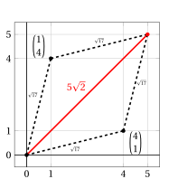
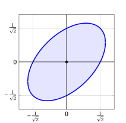

# Norms

**Norms · Chapter 5** · lecture notes by Fabio Furini · [:material-file-pdf-box: Chapter PDF](../pdf/norms-01-norms.pdf)

## 1. Introduction to norms

- A <strong>norm</strong> is a mathematical function that assigns a non-negative length or size to vectors. While there are many different types of norms, they all share three essential properties that ensure they behave consistently and meaningfully.

!!! chiave ""

    <strong>Definition: Norm.</strong>

    A function \(\|\cdot\|: \mathbb{R}^n \to \mathbb{R}\) is called a <strong>norm</strong> if it satisfies the following three properties for all vectors \({\boldsymbol p}, {\boldsymbol w} \in \mathbb{R}^n\) and all scalars \(\lambda \in \mathbb{R}\):

    1. <strong>Non-negativity and definiteness:</strong>

        $$
        \|{\boldsymbol p}\| \ge 0
        \quad \text{and} \quad
        \|{\boldsymbol p}\| = 0 \Longleftrightarrow {\boldsymbol p} = {\boldsymbol 0}
        $$

        The norm is always non-negative, and it equals zero if and only if the vector is the zero vector.

    2. <strong>Absolute homogeneity (or scalability):</strong>

        $$
        \|\lambda \, {\boldsymbol p}\| = |\lambda| \, \|{\boldsymbol p}\|
        $$

        Scaling a vector by a scalar \(\lambda\) scales its norm by the absolute value \(|\lambda|\).

    3. <strong>Triangle inequality (or subadditivity):</strong>

        $$
        \|{\boldsymbol p} + {\boldsymbol w}\| \le \|{\boldsymbol p}\| + \|{\boldsymbol w}\|
        $$

        The norm of the sum of two vectors is at most the sum of their norms.

- <strong>Non-negativity and definiteness</strong> give the norm a reliable meaning as “size” or “length.” They ensure that the norm is never negative and that the only vector with zero length is the zero vector.

- <strong>Absolute homogeneity</strong> ensures that scaling a vector scales its length proportionally. This matches intuition: stretching a vector makes it longer in the same proportion, while reversing its direction does not change its length.

- <strong>Triangle inequality</strong> captures the idea that taking a detour cannot be shorter than going directly. In other words, combining two displacements cannot produce a length larger than the sum of their lengths, reflecting the “straight line is shortest” intuition behind distance.

- Different norms may emphasize different aspects of a vector (e.g., its largest component, the sum of absolute values, or the geometric length), but they all respect these fundamental axioms.

## 2. $\ell_1$ norm

!!! definizione "Definition 1: $\ell_1$ norm"

    The <strong>\(\ell_1\) norm</strong> (also called <strong>Manhattan norm</strong>) of a column vector

    $$
    \underbrace{ 
    \begin{pmatrix}
    p_1 \\
    p_2 \\
    \vdots \\
    p_n
    \end{pmatrix}}_{ {\boldsymbol p}} \in \mathbb{R}^{n}
    $$

    is the non-negative number defined as:

    \begin{equation}
    \|{\boldsymbol p}\|_1 = \sum_{j=1}^n |p_j|
    \label{l1_norm}
    \end{equation}

- The <strong>\(\ell_1\) norm</strong> represents the sum of the absolute values of all components.

- In \(\mathbb{R}^2\), the \(\ell_1\) norm corresponds to the <strong>Manhattan distance</strong> (the distance a taxi would travel on a grid-like street network).

- The \(\ell_1\) norm is widely used in <strong>robust statistics</strong> and <strong>sparse optimization</strong> (e.g., Lasso regression).

!!! esempio "Example 1: \(\ell_1\) norm"

    Consider the vectors:

    $$
    {\boldsymbol p} = \begin{pmatrix} 3 \\ -4 \end{pmatrix} \in \mathbb{R}^{2}, 
    \qquad
    {\boldsymbol w} = \begin{pmatrix} 1 \\ 2 \\ -2 \\ 3 \end{pmatrix} \in \mathbb{R}^{4}
    $$

    Their \(\ell_1\) norms are:

    $$
    \left\| \begin{pmatrix} 3 \\ -4 \end{pmatrix} \right\|_1 = |3| + |-4| = 3 + 4 = 7,
    $$

    $$
    \left\| \begin{pmatrix} 1 \\ 2 \\ -2 \\ 3 \end{pmatrix} \right\|_1 = |1| + |2| + |-2| + |3| = 1 + 2 + 2 + 3 = 8
    $$

- The <strong>\(\ell_1\) norm</strong> of a column vector in \( \mathbb{R}^{n} \) represents the <strong>sum of the absolute values of its components</strong>. In \( \mathbb{R}^2 \), this corresponds to the <strong>Manhattan distance</strong> (the distance traveled along grid lines), as illustrated by the following picture:

{ .fig .ovale loading=lazy style="width:67%" }

- In two dimensions, all the points at \(\ell_1\) norm  less than or equal to 1

    $$
    \{{{{\boldsymbol x}}} \in \mathbb{R}^2 : \|{{{{\boldsymbol x}}}}\|_1 \le 1\}
    $$

    are the points that lie on or inside a <strong>diamond shape</strong> (square rotated by 45°) centered at the origin.

{ .fig .ovale loading=lazy style="width:55%" }

### 2.1 Properties

- The \(\ell_1\) norm satisfies the three fundamental properties that define a norm.

!!! teorema "Observation 1: Non-negativity and definiteness"

    For every column vector ${\boldsymbol p} \in \mathbb{R}^{n}$, we have:

    \begin{equation}
    \|{\boldsymbol p}\|_1 \ge 0
    \quad \text{and} \quad 
    \|{\boldsymbol p}\|_1 = 0 \Longleftrightarrow {\boldsymbol p} = {\boldsymbol 0}
    \label{l1_prop1}
    \end{equation}

??? dimostrazione "Proof"

    From the definition \(\|{\boldsymbol p}\|_1 = \sum_{j=1}^n |p_j|\).

    1. <strong>Non-negativity</strong>: Since \(|p_j| \ge 0\) for all \(j \in \{1,2,\ldots,n\}\), and the sum of non-negative numbers is non-negative, we have

        $$
        \|{\boldsymbol p}\|_1 = \sum_{j=1}^n |p_j| \ge 0
        \quad \text{for all } {\boldsymbol p} \in \mathbb{R}^n.
        $$

    2. <strong>Definiteness</strong>:

        - **(\(\Rightarrow\))** If \(\|{\boldsymbol p}\|_1 = 0\), then \(\sum_{j=1}^n |p_j| = 0\). Since each \(|p_j| \ge 0\), the sum equals zero only if \(|p_j| = 0\) for all \(j \in \{1,2,\ldots,n\}\), hence \(p_j = 0\) for all \(j \in \{1,2,\ldots,n\} \), i.e., \({\boldsymbol p} = {\boldsymbol 0}\).

        - **(\(\Leftarrow\))** If \({\boldsymbol p} = {\boldsymbol 0}\), then \(p_j = 0\) for all \(j \in \{1,2,\ldots,n\}\), so

            $$
            \|{\boldsymbol p}\|_1 = \sum_{j=1}^n |0| = 0.
            $$

    
□

!!! teorema "Observation 2: Absolute homogeneity"

    For every scalar $\lambda \in \R$ and column vector ${\boldsymbol p} \in \mathbb{R}^{n}$, we have:

    \begin{equation}
    \|\lambda \; {\boldsymbol p}\|_1 = |\lambda| \;\| {\boldsymbol p}\|_1
    \label{l1_prop2}
    \end{equation}

??? dimostrazione "Proof"

    For every scalar \(\lambda \in \R\) and every column vector \({\boldsymbol p} \in \mathbb{R}^{n}\), we have:

    \begin{align*}
    \|\lambda \; {\boldsymbol p}\|_1 &= \sum_{j=1}^n |\lambda \; p_j| \\[1ex]
    &= \sum_{j=1}^n |\lambda| \; |p_j| \quad \text{(property of absolute value)} \\[1ex]
    &= |\lambda| \sum_{j=1}^n |p_j| \\[1ex]
    &= |\lambda| \;\| {\boldsymbol p}\|_1
    \end{align*}

    
□

!!! teorema "Observation 3: Triangle inequality"

    For every pair of column vectors ${\boldsymbol p},{\boldsymbol w} \in \mathbb{R}^{n}$, we have:

    \begin{equation}
    \|{\boldsymbol p} + {\boldsymbol w}\|_1 \le \|{\boldsymbol p}\|_1 + \|{\boldsymbol w}\|_1
    \label{l1_prop3}
    \end{equation}

??? dimostrazione "Proof"

    For every pair of vectors \({\boldsymbol p}, {\boldsymbol w} \in \mathbb{R}^n\), we have:

    \begin{align*}
    \|{\boldsymbol p} + {\boldsymbol w}\|_1 
    &= \sum_{j=1}^n |p_j + w_j| \\[2ex]
    &\le \sum_{j=1}^n (|p_j| + |w_j|) \quad \text{(triangle inequality for absolute value)} \\[2ex]
    &= \sum_{j=1}^n |p_j| + \sum_{j=1}^n |w_j| \\[2ex]
    &= \|{\boldsymbol p}\|_1 + \|{\boldsymbol w}\|_1
    \end{align*}

    
□

## 3. $\ell_2$ norm

!!! definizione "Definition 2: $\ell_2$ norm"

    The <strong>\(\ell_2\) norm</strong> (also called <strong>Euclidean norm</strong>) of a column vector

    $$
    \underbrace{ 
    \begin{pmatrix}
    p_1 \\
    p_2 \\
    \vdots \\
    p_n
    \end{pmatrix}}_{ {\boldsymbol p}} \in \mathbb{R}^{n}
    $$

    is the non-negative number defined as:

    \begin{equation}
    \|{\boldsymbol p}\|_2 = \underbrace{\sqrt{\sum_{j=1}^n p_j^2}}_{\sqrt{{\boldsymbol p}' \; {\boldsymbol p}} }
    \label{eucl_norm}
    \end{equation}

- When the subscript is omitted, i.e., when we write \(\|{\boldsymbol p}\|\) instead of \(\|{\boldsymbol p}\|_2\), the \(\ell_2\) norm is implied by default.

!!! esempio "Example 2:  <strong>\(\ell_2\) norm</strong> "

    - Consider the two vectors:

        $$
        \begin{pmatrix} 1 \\ 4 \end{pmatrix} \in \mathbb{R}^{2} 
        \qquad \text{and} \qquad
        \begin{pmatrix} 4 \\ 1 \end{pmatrix} \in \mathbb{R}^{2},
        $$

        Their norms are:

        $$
        \left\| \begin{pmatrix} 1 \\ 4 \end{pmatrix} \right\|_2 = \sqrt{1^2 + 4^2} = \sqrt{1 + 16} = \sqrt{17}, 
        \qquad
        \left\| \begin{pmatrix} 4 \\ 1 \end{pmatrix} \right\|_2 = \sqrt{4^2 + 1^2} = \sqrt{16 + 1} = \sqrt{17}
        $$

    - Consider the four vertices of the diamond-shaped \(\ell_1\) unit ball in \( \mathbb{R}^2 \):

        $$
        \begin{pmatrix} 1 \\ 0 \end{pmatrix}, \quad
        \begin{pmatrix} 0 \\ 1 \end{pmatrix}, \quad
        \begin{pmatrix} -1 \\ 0 \end{pmatrix}, \quad
        \begin{pmatrix} 0 \\ -1 \end{pmatrix}
        $$

        Their norms are:

        $$
        \left\| \begin{pmatrix} 1 \\ 0 \end{pmatrix} \right\|_2 = \sqrt{1^2 + 0^2} = 1, ~
        \left\| \begin{pmatrix} 0 \\ 1 \end{pmatrix} \right\|_2 = \sqrt{0^2 + 1^2} = 1, ~
        \left\| \begin{pmatrix} -1 \\ 0 \end{pmatrix} \right\|_2 = \sqrt{(-1)^2 + 0^2} = 1, ~
        \left\| \begin{pmatrix} 0 \\ -1 \end{pmatrix} \right\|_2 = \sqrt{0^2 + (-1)^2} = 1
        $$

- The <strong>\(\ell_2\) norm</strong> of a column vector in \( \mathbb{R}^{n} \) represents its <strong>Euclidean distance from the origin</strong>. This interpretation follows from the <strong>Pythagorean theorem</strong>, as illustrated in \( \mathbb{R}^2 \) by the following picture:

{ .fig .ovale loading=lazy style="width:67%" }

- In two dimensions, all the points at \(\ell_2\) norm  less than or equal to 1

    $$
    \{{{{\boldsymbol x}}} \in \mathbb{R}^2 : \|{{{{\boldsymbol x}}}}\|_2 \le 1\}
    $$

    are the points that lie on or inside the <strong>unit circle</strong> centered at the origin.

{ .fig .ovale loading=lazy style="width:55%" }

!!! chiave ""

    Given two column vectors

    $$
    \underbrace{\begin{pmatrix}
    p_1 \\
    p_2 \\
    \vdots \\
    p_n
    \end{pmatrix}}_{ {\boldsymbol p}} \in \mathbb{R}^{n} 
    \qquad \text{and} \qquad 
    \underbrace{ \begin{pmatrix}
    w_1 \\
    w_2 \\
    \vdots \\
    w_n
    \end{pmatrix}}_{ {\boldsymbol w}} \in \mathbb{R}^{n}
    $$

    the norm of the <strong>difference</strong> of the two vectors is:

    $$
    \|{\boldsymbol p} - {\boldsymbol w}\|_2 = \sqrt{\sum_{j=1}^n \left(p_j - w_j\right)^2}
    $$

    This quantity corresponds both to the <strong>Euclidean distance</strong> between the two points \( {\boldsymbol p} \) and \( {\boldsymbol w} \), and to the <strong>length of the diagonal</strong> of the parallelogram spanned by those points, starting from one and pointing to the other.

!!! esempio "Example 3: <strong>\(\ell_2\) norm</strong>  the difference of vectors"

    Consider the two vectors:

    $$
    \begin{pmatrix} 1 \\ 4 \end{pmatrix} \in \mathbb{R}^{2} 
    \qquad \text{and} \qquad
    \begin{pmatrix} 4 \\ 1 \end{pmatrix} \in \mathbb{R}^{2},
    $$

    The norm of the difference of the two vectors is

    $$
    \left\| \begin{pmatrix} 1 \\ 4 \end{pmatrix} - \begin{pmatrix} 4 \\ 1 \end{pmatrix} \right\|_2 
    = \sqrt{(1 - 4)^2 + (4 - 1)^2}
    = \sqrt{(-3)^2 + 3^2}
    = \sqrt{9 + 9}
    = \sqrt{18}
    = 3\sqrt{2}
    $$

    Graphically, we have:

    { .fig .ovale loading=lazy style="width:48%" }

!!! chiave ""

    Given two column vectors

    $$
    \underbrace{\begin{pmatrix}
    p_1 \\
    p_2 \\
    \vdots \\
    p_n
    \end{pmatrix}}_{ {\boldsymbol p}} \in \mathbb{R}^{n}
    \quad \text{and} \quad 
    \underbrace{\begin{pmatrix}
    w_1 \\
    w_2 \\
    \vdots \\
    w_n
    \end{pmatrix}}_{ {\boldsymbol w}} \in \mathbb{R}^{n},
    $$

    the norm of the <strong>sum</strong> of the two vectors is:

    $$
    \|{\boldsymbol p} + {\boldsymbol w}\|_2 = \sqrt{\sum_{j=1}^n \left(p_j + w_j\right)^2}
    $$

    This quantity represents the <strong>length of the diagonal</strong> of the parallelogram spanned by the vectors \( {\boldsymbol p} \) and \( {\boldsymbol w} \), both originating from the origin.

!!! esempio "Example 4: <strong>\(\ell_2\) norm</strong> of the sum of vectors"

    Consider the two vectors:

    $$
    \begin{pmatrix} 1 \\ 4 \end{pmatrix} \in \mathbb{R}^{2} 
    \qquad \text{and} \qquad
    \begin{pmatrix} 4 \\ 1 \end{pmatrix} \in \mathbb{R}^{2},
    $$

    The norm of the sum of the two vectors is:

    $$
    \left\| \begin{pmatrix} 1 \\ 4 \end{pmatrix} + \begin{pmatrix} 4 \\ 1 \end{pmatrix} \right\|_2
    = \sqrt{5^2 + 5^2}
    = 5\sqrt{2}
    $$

    Graphically, we have:

    { .fig .ovale loading=lazy style="width:48%" }

### 3.1 Cauchy–Schwarz inequality

!!! teorema "Observation 4: Cauchy–Schwarz inequality"

    For every pair of column vectors ${\boldsymbol p},{\boldsymbol w} \in \mathbb{R}^{n}$, we have:

    \begin{equation}
    |{\boldsymbol p}' \; {\boldsymbol w}| \le \|{\boldsymbol p}\|_2 \; \|{\boldsymbol w}\|_2
    \label{norm_2}
    \end{equation}

??? dimostrazione "Proof"

    If \( {\boldsymbol p} = {\boldsymbol 0} \) or \( {\boldsymbol w} = {\boldsymbol 0} \) (or both), the inequality clearly holds.

    Assume \( {\boldsymbol p} \neq {\boldsymbol 0} \) and \( {\boldsymbol w} \neq {\boldsymbol 0} \). Consider the vector:

    $$
    {\boldsymbol u} = \alpha \; {\boldsymbol p} + \beta \; {\boldsymbol w}, \qquad \text{with } \alpha, \beta \in \mathbb{R}
    $$

    Then, for every \( \alpha, \beta \in \mathbb{R} \), we have:

    \begin{align*}
    \underbrace{{\boldsymbol u}' \; {\boldsymbol u}}_{\ge 0}
    &= (\alpha \; {\boldsymbol p} + \beta \; {\boldsymbol w})' \; (\alpha \; {\boldsymbol p} + \beta \; {\boldsymbol w}) \\[1ex]
    &= \alpha^2 \; {\boldsymbol p}' \; {\boldsymbol p} 
    + 2\alpha\beta \; {\boldsymbol p}' \; {\boldsymbol w} 
    + \beta^2 \; {\boldsymbol w}' \; {\boldsymbol w} \ge 0
    \end{align*}

    Now choose:

    $$
    \alpha = {\boldsymbol w}' \; {\boldsymbol w}, \qquad 
    \beta = -{\boldsymbol p}' \; {\boldsymbol w}
    $$

    Substituting, we get:

    \begin{align*}
    &({\boldsymbol w}' \; {\boldsymbol w})^2 \; {\boldsymbol p}' \; {\boldsymbol p}
    - 2 \; ({\boldsymbol p}' \; {\boldsymbol w})^2 \; ({\boldsymbol w}' \; {\boldsymbol w})
    + ({\boldsymbol p}' \; {\boldsymbol w})^2 \; ({\boldsymbol w}' \; {\boldsymbol w}) \\[1ex]
    &= {\boldsymbol w}' \; {\boldsymbol w} \; 
    \left( ({\boldsymbol w}' \; {\boldsymbol w}) \; {\boldsymbol p}' \; {\boldsymbol p} 
    - ({\boldsymbol p}' \; {\boldsymbol w})^2 \right) \ge 0
    \end{align*}

    Since \( {\boldsymbol w}' \; {\boldsymbol w} = \|{\boldsymbol w}\|_2^2 > 0 \), dividing both sides yields:

    $$
    ({\boldsymbol p}' \; {\boldsymbol w})^2 \le {\boldsymbol p}' \; {\boldsymbol p} \; {\boldsymbol w}' \; {\boldsymbol w}
    \quad \Longrightarrow \quad
    |{\boldsymbol p}' \; {\boldsymbol w}| \le \sqrt{{\boldsymbol p}' \; {\boldsymbol p} \; {\boldsymbol w}' \; {\boldsymbol w}} 
    = \sqrt{{\boldsymbol p}' \; {\boldsymbol p}} \; \sqrt{{\boldsymbol w}' \; {\boldsymbol w}} 
    = \|{\boldsymbol p}\|_2 \; \|{\boldsymbol w}\|_2
    $$

    
□

### 3.2 Properties

- The \(\ell_2\) norm satisfies the three fundamental properties that define a norm.

!!! teorema "Observation 5: Non-negativity and definiteness"

    For every column vector ${\boldsymbol p} \in \mathbb{R}^{n}$, we have:

    \begin{equation}
    \|{\boldsymbol p}\|_2 \ge 0
    \quad \text{and} \quad 
    \|{\boldsymbol p}\|_2 = 0 \Longleftrightarrow {\boldsymbol p} = 
    {\boldsymbol 0}
    \label{scalar_4}
    \end{equation}

??? dimostrazione "Proof"

    From the definition \(\|{\boldsymbol p}\|_2 = \sqrt{{\boldsymbol p}' \, {\boldsymbol p}}\).

    1. <strong>Non-negativity</strong>: Since \({\boldsymbol p}' \, {\boldsymbol p} = \sum_{j=1}^n p_j^2 \ge 0\) (as a sum of squares), and the square root function yields non-negative values, we have \(\|{\boldsymbol p}\|_2 \ge 0\) for all \({\boldsymbol p} \in \mathbb{R}^n\).

    2. <strong>Definiteness</strong>:

        - **(\(\Rightarrow\))** If \(\|{\boldsymbol p}\|_2 = 0\), then \(\sqrt{{\boldsymbol p}' \, {\boldsymbol p}} = 0\), hence \({\boldsymbol p}' \, {\boldsymbol p} = 0\), i.e.

            $$
            \sum_{j=1}^n p_j^2 = 0.
            $$

            Since each \(p_j^2 \ge 0\), the sum equals zero only if \(p_j^2 = 0\) for all \(j \in \{1,2,\ldots,n\}\), hence \(p_j = 0\) for all \(j \in \{1,2,\ldots,n\}\), i.e., \({\boldsymbol p} = {\boldsymbol 0}\).

        - **(\(\Leftarrow\))** If \({\boldsymbol p} = {\boldsymbol 0}\), then \({\boldsymbol p}' \, {\boldsymbol p} = 0\), so \(\|{\boldsymbol p}\|_2 = \sqrt{0} = 0\).

    
□

!!! teorema "Observation 6: Absolute homogeneity"

    For every column vector ${\boldsymbol p} \in \mathbb{R}^{n}$ and scalar $\lambda \in \R$, we have:

    \begin{equation}
    \|\lambda \; {\boldsymbol p}\|_2 = |\lambda| \;\| {\boldsymbol p}\|_2
    \label{norm_1}
    \end{equation}

??? dimostrazione "Proof"

    For every scalar  $\lambda \in \R$ and every column vector ${\boldsymbol p} \in \mathbb{R}^{n}$, we have:

    $$
    \|\lambda \; {\boldsymbol p}\|_2 = \sqrt{\sum_{j=1}^n (\lambda \; p_j)^2} = \sqrt{\sum_{j=1}^n \lambda^2 \; p_j^2}=|\lambda| \; \sqrt{\sum_{j=1}^n \; p_j^2}=|\lambda| \;\| {\boldsymbol p}\|_2
    $$

    
□

!!! teorema "Observation 7: Triangle inequality"

    For every pair of column vectors ${\boldsymbol p},{\boldsymbol w} \in \mathbb{R}^{n}$, we have:

    \begin{equation}
    \|{\boldsymbol p} + {\boldsymbol w}\|_2 \le \|{\boldsymbol p}\|_2 + \|{\boldsymbol w}\|_2
    \label{TTTTT}
    \end{equation}

??? dimostrazione "Proof"

    For every pair of vectors \( {\boldsymbol p}, {\boldsymbol w} \in \mathbb{R}^n \), we have:

    \begin{align*}
    \|{\boldsymbol p} + {\boldsymbol w}\|_2^2 
    &= ({\boldsymbol p} + {\boldsymbol w})' \; ({\boldsymbol p} + {\boldsymbol w}) = {\boldsymbol p}' \; {\boldsymbol p} + 2 \; {\boldsymbol p}' \; {\boldsymbol w} + {\boldsymbol w}' \; {\boldsymbol w} = \|{\boldsymbol p}\|_2^2 + \|{\boldsymbol w}\|_2^2 + 2 \; {\boldsymbol p}' \; {\boldsymbol w} \\[1ex]
    &\le \|{\boldsymbol p}\|_2^2 + \|{\boldsymbol w}\|_2^2 + 2 \; \|{\boldsymbol p}\|_2 \; \|{\boldsymbol w}\|_2 
    \qquad \text{(by Cauchy–Schwarz inequality)} \\[1ex]
    &= \left( \|{\boldsymbol p}\|_2 + \|{\boldsymbol w}\|_2 \right)^2
    \end{align*}

    Accordingly, we obtain:

    $$
    \|{\boldsymbol p} + {\boldsymbol w}\|_2^2 
    \le \left( \|{\boldsymbol p}\|_2 + \|{\boldsymbol w}\|_2 \right)^2 
    \quad \Longrightarrow \quad
    \|{\boldsymbol p} + {\boldsymbol w}\|_2 \le \|{\boldsymbol p}\|_2 + \|{\boldsymbol w}\|_2
    $$

    
□

- In $\R^2$, the triangle inequality states that <strong>for any triangle the sum of the lengths of any two sides must be greater than or equal to the length of the remaining side</strong>.

!!! esempio "Example 5: triangle inequality"

    Consider the two vectors $\begin{pmatrix} 1 \\ 4 \end{pmatrix}  \in \R^2$ and $\begin{pmatrix} 4 \\ 1 \end{pmatrix}  \in \R^2$, we have:

    $$
    \left\| \begin{pmatrix} 1 \\ 4 \end{pmatrix} \right\|_2 = \sqrt{1^2 + 4^2} = \sqrt{1 + 16} = \sqrt{17}
    $$

    $$
    \left\| \begin{pmatrix} 4 \\ 1 \end{pmatrix} \right\|_2 = \sqrt{4^2 + 1^2} = \sqrt{16 + 1} = \sqrt{17}
    $$

    \begin{align*}
    \left\| \begin{pmatrix} 1 \\ 4 \end{pmatrix} + \begin{pmatrix} 4 \\ 1 \end{pmatrix} \right\|_2 = \sqrt{(1 + 4)^2 + (4 + 1)^2} = \sqrt{5^2 + 5^2}= 5\sqrt{2}
    \end{align*}

    $$
    5\sqrt{2} \le \sqrt{17} + \sqrt{17}
    $$

    { .fig .ovale loading=lazy style="width:48%" }

- Another form of the triangle inequality is:

    \begin{equation}
    \|{\boldsymbol r}\|_2 \le \|{\boldsymbol r}-{\boldsymbol s}\|_2 + \|{\boldsymbol s}\|_2 {\rm ~~~~~that~is~~~~~} \|{\boldsymbol r}\|_2 - \|{\boldsymbol s}\|_2 \le \|{\boldsymbol r}-{\boldsymbol s}\|_2 , \quad \forall  {\boldsymbol r},{\boldsymbol s} \in \mathbb{R}^n
     \label{CCCC}
    \end{equation}

    To obtain it, it suffices to set in \(\eqref{TTTTT}\):

    $$
    {\boldsymbol p} =  {\boldsymbol r} - {\boldsymbol s}, \quad  {\boldsymbol w} = {\boldsymbol s}
    $$

!!! teorema "Observation 8: reverse triangle inequality"

    For every pair of column vectors ${\boldsymbol p},{\boldsymbol w} \in \mathbb{R}^{n}$, we have:

    \begin{equation}
    | \|{\boldsymbol p}\|_2 - \|{\boldsymbol w}\|_2  |  \le \|{\boldsymbol p} - {\boldsymbol w}\|_2
    \label{KKKKK}
    \end{equation}

??? dimostrazione "Proof"

    For every two vectors \( {\boldsymbol p}, {\boldsymbol w} \in \mathbb{R}^n \), we have:

    \begin{align*}
    \|{\boldsymbol p} - {\boldsymbol w}\|_2^2 
    &= ({\boldsymbol p} - {\boldsymbol w})' \; ({\boldsymbol p} - {\boldsymbol w}) = {\boldsymbol p}' \; {\boldsymbol p} - 2 \; {\boldsymbol p}' \; {\boldsymbol w} + {\boldsymbol w}' \; {\boldsymbol w} = \|{\boldsymbol p}\|_2^2 + \|{\boldsymbol w}\|_2^2 - 2 \; {\boldsymbol p}' \; {\boldsymbol w} \\[1ex]
    &\ge \|{\boldsymbol p}\|_2^2 + \|{\boldsymbol w}\|_2^2 - 2 \; \|{\boldsymbol p}\|_2 \; \|{\boldsymbol w}\|_2 
    \qquad \text{(by Cauchy–Schwarz inequality)} \\[1ex]
    &= \left( \|{\boldsymbol p}\|_2 - \|{\boldsymbol w}\|_2 \right)^2
    \end{align*}

    Accordingly, we obtain:

    $$
    \left( \|{\boldsymbol p}\|_2 - \|{\boldsymbol w}\|_2 \right)^2 
    \le \|{\boldsymbol p} - {\boldsymbol w}\|_2^2 
    \quad \Longrightarrow \quad
    | \|{\boldsymbol p}\|_2 - \|{\boldsymbol w}\|_2 | \le \|{\boldsymbol p} - {\boldsymbol w}\|_2
    $$

    
□

- In $\R^2$, the reverse triangle inequality states that <strong>for any triangle the length of any side must be greater than or equal to the difference between the lengths of the other two sides</strong>.

!!! esempio "Example 6: reverse triangle inequality"

    Consider the two vectors $\begin{pmatrix} 1 \\ 4 \end{pmatrix}  \in \R^2$ and $\begin{pmatrix} 4 \\ 1 \end{pmatrix}  \in \R^2$, we have:

    $$
    \left\| \begin{pmatrix} 1 \\ 4 \end{pmatrix} \right\|_2 = \sqrt{1^2 + 4^2} = \sqrt{1 + 16} = \sqrt{17}
    $$

    $$
    \left\| \begin{pmatrix} 4 \\ 1 \end{pmatrix} \right\|_2 = \sqrt{4^2 + 1^2} = \sqrt{16 + 1} = \sqrt{17}
    $$

    \begin{align*}
    \left\| \begin{pmatrix} 1 \\ 4 \end{pmatrix} - \begin{pmatrix} 4 \\ 1 \end{pmatrix} \right\|_2  = \sqrt{(1 - 4)^2 + (4 - 1)^2}= 3\sqrt{2}
    \end{align*}

    $$
    \left| \sqrt{17} - \sqrt{17} \right|  \le 3\sqrt{2}
    $$

    { .fig .ovale loading=lazy style="width:48%" }

## 4. Generalized $\ell_2$ norm

!!! definizione "Definition 3: generalized $\ell_2$ norm"

    Given a symmetric positive definite matrix

    $$
    \underbrace{
    \begin{pmatrix}
    q_{11} & q_{12} & \ldots & q_{1n} \\[0.5ex]
    q_{21} & q_{22} & \ldots & q_{2n} \\[0.5ex]
    \vdots & \vdots & \ddots & \vdots \\[0.5ex]
    q_{n1} & q_{n2} & \ldots & q_{nn}
    \end{pmatrix}}_{\,\boldsymbol{Q}} \in \mathbb{R}^{n \times n}
    $$

    the <strong>generalized \(\ell_2\) norm</strong> of a column vector

    $$
    \underbrace{
    \begin{pmatrix}
    p_1 \\
    p_2 \\
    \vdots \\
    p_n
    \end{pmatrix}}_{\,\boldsymbol{p}} \in \mathbb{R}^{n}
    $$

    is the non-negative number defined as:

    \begin{equation}
    \| \boldsymbol{p} \|_{\boldsymbol{Q}} 
    = \underbrace{\sqrt{\sum_{i=1}^n \sum_{j=1}^n q_{ij} \, p_i \, p_j}}_{\,\sqrt{\boldsymbol{p}' \boldsymbol{Q} \boldsymbol{p}}}
    \label{extend_norm}
    \end{equation}

- The <strong>generalized \(\ell_2\) norm</strong> extends the standard Euclidean norm by incorporating a positive definite matrix \(\boldsymbol{Q}\), which weights and potentially correlates the components of the vector.

- When \(\boldsymbol{Q}\) is the identity matrix \(\boldsymbol{I}\), the generalized \(\ell_2\) norm reduces to the standard \(\ell_2\) norm.

- The matrix \(\boldsymbol{Q}\) must be <strong>positive definite</strong> to ensure that \(\boldsymbol{p}' \boldsymbol{Q} \boldsymbol{p} \ge 0\) for all \(\boldsymbol{p} \in \mathbb{R}^n\), making the square root well-defined, and that \(\boldsymbol{p}' \boldsymbol{Q} \boldsymbol{p} = 0\) only for \(\boldsymbol{p} = \boldsymbol{0}\).

- In two dimensions, all the points at generalized \(\ell_2\) norm less than or equal to 1

    $$
    \{{{{\boldsymbol x}}} \in \mathbb{R}^2 : \|{{{{\boldsymbol x}}}}\|_{\boldsymbol{Q}} \le 1\}
    $$

    are the points that lie on or inside an <strong>ellipse</strong> centered at the origin, whose size, shape, and rotation are determined by the matrix \(\boldsymbol{Q}\). In particular, the eigenvectors of \(\boldsymbol{Q}\) determine the principal axes and the orientation, while the eigenvalues determine the lengths of the semi-axes.

!!! esempio "Example 7: <strong>generalized \(\ell_2\) norm</strong>"

    In $\mathbb{R}^2$, we consider the following diagonal positive definite matrix

    $$
    {\boldsymbol Q} =
    \begin{pmatrix}
    4 & 0 \\[1ex]
    0 & 1
    \end{pmatrix}
    $$

    Since \(\boldsymbol{Q}\) is <strong>diagonal</strong>, the eigenvalues are the diagonal entries:

    $$
    \lambda_1 = 4, \qquad \lambda_2 = 1
    $$

    and the eigenvectors are the standard basis vectors:

    $$
    \boldsymbol{v}_1 = \begin{pmatrix} 1 \\[0.5ex] 0 \end{pmatrix}
    \quad \text{(for } \lambda_1 = 4\text{)},
    \qquad
    \boldsymbol{v}_2 = \begin{pmatrix} 0 \\[0.5ex] 1 \end{pmatrix}
    \quad \text{(for } \lambda_2 = 1\text{)}
    $$

    <strong>Semi-axes lengths and orientation:</strong>

    - The semi-axes lengths are \(\frac{1}{\sqrt{\lambda_1}} = \frac{1}{\sqrt{4}} = \frac{1}{2}\) and \(\frac{1}{\sqrt{\lambda_2}} = \frac{1}{\sqrt{1}} = 1\).

    - Since the eigenvectors are aligned with the coordinate axes, the ellipse is <strong>not rotated</strong>.

    - The principal axes coincide with the \(x_1\) and \(x_2\) axes.

    The set of points at generalized \(\ell_2\) norm \(\le 1\) from the origin is:

    $$
    \{{{{\boldsymbol x}}} \in \mathbb{R}^2 : \|{{{{\boldsymbol x}}}}\|_{\boldsymbol{Q}} \le 1\}
    =
    \left\{
    \begin{pmatrix}
    x_1 \\[0.3ex]
    x_2
    \end{pmatrix}
    \in \mathbb{R}^2 :
    \sqrt{4 x_1^2 + x_2^2} \le 1
    \right\}
    =
    \left\{
    \begin{pmatrix}
    x_1 \\[0.3ex]
    x_2
    \end{pmatrix}
    \in \mathbb{R}^2 :
    \frac{x_1^2}{(1/2)^2} + \frac{x_2^2}{1^2} \le 1
    \right\}
    $$

    { .fig .ovale loading=lazy style="width:48%" }

!!! esempio "Example 8: <strong>generalized \(\ell_2\) norm</strong>"

    In $\mathbb{R}^2$, we consider the following diagonal positive definite matrix

    $$
    {\boldsymbol Q} =
    \begin{pmatrix}
    \frac{1}{9} & 0 \\[1ex]
    0 & \frac{1}{4}
    \end{pmatrix}
    $$

    Since \(\boldsymbol{Q}\) is <strong>diagonal</strong>, the eigenvalues are the diagonal entries:

    $$
    \lambda_1 = \frac{1}{9}, \qquad \lambda_2 = \frac{1}{4}
    $$

    and the eigenvectors are the standard basis vectors:

    $$
    \boldsymbol{v}_1 = \begin{pmatrix} 1 \\[0.5ex] 0 \end{pmatrix}
    \quad \text{(for } \lambda_1 = \frac{1}{9}\text{)},
    \qquad
    \boldsymbol{v}_2 = \begin{pmatrix} 0 \\[0.5ex] 1 \end{pmatrix}
    \quad \text{(for } \lambda_2 = \frac{1}{4}\text{)}
    $$

    <strong>Semi-axes lengths and orientation:</strong>

    - The semi-axes lengths are \(\frac{1}{\sqrt{\lambda_1}} = \frac{1}{\sqrt{1/9}} = 3\) and \(\frac{1}{\sqrt{\lambda_2}} = \frac{1}{\sqrt{1/4}} = 2\).

    - Since the eigenvectors are aligned with the coordinate axes, the ellipse is <strong>not rotated</strong>.

    - The principal axes coincide with the \(x_1\) and \(x_2\) axes.

    The set of points at generalized \(\ell_2\) norm \(\le 1\) from the origin is:

    $$
    \{{{{\boldsymbol x}}} \in \mathbb{R}^2 : \|{{{{\boldsymbol x}}}}\|_{\boldsymbol{Q}} \le 1\}
    =
    \left\{
    \begin{pmatrix}
    x_1 \\[0.3ex]
    x_2
    \end{pmatrix}
    \in \mathbb{R}^2 :
    \sqrt{\frac{x_1^2}{9} + \frac{x_2^2}{4}} \le 1
    \right\}
    =
    \left\{
    \begin{pmatrix}
    x_1 \\[0.3ex]
    x_2
    \end{pmatrix}
    \in \mathbb{R}^2 :
    \frac{x_1^2}{3^2} + \frac{x_2^2}{2^2} \le 1
    \right\}
    $$

    { .fig .ovale loading=lazy style="width:55%" }

!!! esempio "Example 9: <strong>generalized \(\ell_2\) norm</strong>"

    In $\mathbb{R}^2$, we consider the following symmetric positive definite matrix

    $$
    {\boldsymbol Q} =
    \begin{pmatrix}
    2 & -1 \\[1ex]
    -1 & 2
    \end{pmatrix}
    $$

    The eigenvalues of \(\boldsymbol{Q}\) are found by solving the characteristic equation:

    $$
    \det(\boldsymbol{Q} - \lambda \boldsymbol{I}) = \det\begin{pmatrix}
    2-\lambda & -1 \\[0.5ex]
    -1 & 2-\lambda
    \end{pmatrix}
    = (2-\lambda)^2 - 1 = \lambda^2 - 4\lambda + 3 = 0
    $$

    which gives:

    $$
    \lambda_1 = 1, \qquad \lambda_2 = 3
    $$

    The corresponding eigenvectors are:

    $$
    \boldsymbol{v}_1 = \begin{pmatrix} 1 \\[0.5ex] 1 \end{pmatrix}
    \quad \text{(for } \lambda_1 = 1\text{)},
    \qquad
    \boldsymbol{v}_2 = \begin{pmatrix} 1 \\[0.5ex] -1 \end{pmatrix}
    \quad \text{(for } \lambda_2 = 3\text{)}
    $$

    <strong>Semi-axes lengths and orientation:</strong>

    - The semi-axes lengths are \(\frac{1}{\sqrt{\lambda_1}} = \frac{1}{\sqrt{1}} = 1\) and \(\frac{1}{\sqrt{\lambda_2}} = \frac{1}{\sqrt{3}}\).

    - Since the eigenvectors are <strong>not aligned</strong> with the coordinate axes, the ellipse is <strong>rotated</strong>.

    - The principal axes coincide with the directions of the eigenvectors.

    The set of points at generalized \(\ell_2\) norm \(\le 1\) from the origin is:

    $$
    \{{{{\boldsymbol x}}} \in \mathbb{R}^2 : \|{{{{\boldsymbol x}}}}\|_{\boldsymbol{Q}} \le 1\}
    =
    \left\{
    \begin{pmatrix}
    x_1 \\[0.3ex]
    x_2
    \end{pmatrix}
    \in \mathbb{R}^2 :
    \sqrt{2x_1^2 - 2x_1x_2 + 2x_2^2} \le 1
    \right\}
    =
    \left\{
    \begin{pmatrix}
    x_1 \\[0.3ex]
    x_2
    \end{pmatrix}
    \in \mathbb{R}^2 :
    2x_1^2 - 2x_1x_2 + 2x_2^2 \le 1
    \right\}
    $$

    { .fig .ovale loading=lazy style="width:53%" }

### 4.1 Generalized Cauchy–Schwarz inequality

!!! teorema "Observation 9: generalized Cauchy–Schwarz inequality"

    For every symmetric positive definite matrix $\boldsymbol{Q} \in \mathbb{R}^{n \times n}$ and pair of column vectors ${\boldsymbol p},{\boldsymbol w} \in \mathbb{R}^{n}$, we have:

    \begin{equation}
    |{\boldsymbol p}' \; {\boldsymbol Q} \; {\boldsymbol w}| 
    \le \|{\boldsymbol p}\|_{\boldsymbol Q} \; \|{\boldsymbol w}\|_{\boldsymbol Q}
    \label{norm_10000}
    \end{equation}

??? dimostrazione "Proof"

    If \( {\boldsymbol p} = {\boldsymbol 0} \) or \( {\boldsymbol w} = {\boldsymbol 0} \) (or both), the inequality clearly holds.

    Assume \( {\boldsymbol p} \neq {\boldsymbol 0} \) and \( {\boldsymbol w} \neq {\boldsymbol 0} \). Consider the vector:

    $$
    {\boldsymbol u} = \alpha \; {\boldsymbol p} + \beta \; {\boldsymbol w}, \qquad \text{with } \alpha, \beta \in \mathbb{R}
    $$

    Then, for every \( \alpha, \beta \in \mathbb{R} \), we have:

    \begin{align*}
    \underbrace{{\boldsymbol u}' \; {\boldsymbol Q} \; {\boldsymbol u}}_{\ge 0}
    &= (\alpha \; {\boldsymbol p} + \beta \; {\boldsymbol w})' \; {\boldsymbol Q} \; (\alpha \; {\boldsymbol p} + \beta \; {\boldsymbol w}) \\[1ex]
    &= \alpha^2 \; {\boldsymbol p}' \; {\boldsymbol Q} \; {\boldsymbol p} 
    + 2\alpha\beta \; {\boldsymbol p}' \; {\boldsymbol Q} \; {\boldsymbol w} 
    + \beta^2 \; {\boldsymbol w}' \; {\boldsymbol Q} \; {\boldsymbol w} \ge 0
    \end{align*}

    where we used \({\boldsymbol w}' \; {\boldsymbol Q} \; {\boldsymbol p} = {\boldsymbol p}' \; {\boldsymbol Q} \; {\boldsymbol w}\), which holds since \({\boldsymbol Q}\) is symmetric.

    Now choose:

    $$
    \alpha = {\boldsymbol w}' \; {\boldsymbol Q} \; {\boldsymbol w}, \qquad 
    \beta = -{\boldsymbol p}' \; {\boldsymbol Q} \; {\boldsymbol w}
    $$

    Substituting, we get:

    \begin{align*}
    &({\boldsymbol w}' \; {\boldsymbol Q} \; {\boldsymbol w})^2 \; {\boldsymbol p}' \; {\boldsymbol Q} \; {\boldsymbol p}
    - 2 \; ({\boldsymbol p}' \; {\boldsymbol Q} \; {\boldsymbol w})^2 \; ({\boldsymbol w}' \; {\boldsymbol Q} \; {\boldsymbol w})
    + ({\boldsymbol p}' \; {\boldsymbol Q} \; {\boldsymbol w})^2 \; ({\boldsymbol w}' \; {\boldsymbol Q} \; {\boldsymbol w}) \\[1ex]
    &= {\boldsymbol w}' \; {\boldsymbol Q} \; {\boldsymbol w} \; 
    \left( ({\boldsymbol w}' \; {\boldsymbol Q} \; {\boldsymbol w}) \; {\boldsymbol p}' \; {\boldsymbol Q} \; {\boldsymbol p} 
    - ({\boldsymbol p}' \; {\boldsymbol Q} \; {\boldsymbol w})^2 \right) \ge 0
    \end{align*}

    Since \( {\boldsymbol w}' \; {\boldsymbol Q} \; {\boldsymbol w} = \|{\boldsymbol w}\|_{\boldsymbol Q}^2 > 0 \), dividing both sides yields:

    $$
    ({\boldsymbol p}' \; {\boldsymbol Q} \; {\boldsymbol w})^2 \le {\boldsymbol p}' \; {\boldsymbol Q} \; {\boldsymbol p} \cdot {\boldsymbol w}' \; {\boldsymbol Q} \; {\boldsymbol w}
    \quad \Longrightarrow \quad
    |{\boldsymbol p}' \; {\boldsymbol Q} \; {\boldsymbol w}| \le \sqrt{{\boldsymbol p}' \; {\boldsymbol Q} \; {\boldsymbol p}} \; \sqrt{{\boldsymbol w}' \; {\boldsymbol Q} \; {\boldsymbol w}} 
    = \|{\boldsymbol p}\|_{\boldsymbol Q} \; \|{\boldsymbol w}\|_{\boldsymbol Q}
    $$

    
□

### 4.2 Properties

- The generalized \(\ell_2\) norm satisfies the three fundamental properties that define a norm.

!!! teorema "Observation 10: Non-negativity and definiteness"

    For every positive definite matrix $\boldsymbol{Q} \in \mathbb{R}^{n \times n}$ and column vector ${\boldsymbol p} \in \mathbb{R}^{n}$, we have:

    \begin{equation}
    \|{\boldsymbol p}\|_{\boldsymbol Q} \ge 0
    \quad \text{and} \quad 
    \|{\boldsymbol p}\|_{\boldsymbol Q}= 0 \Longleftrightarrow {\boldsymbol p} = 
    {\boldsymbol 0}
    \label{scalar_6}
    \end{equation}

??? dimostrazione "Proof"

    By definition, \(\|{\boldsymbol p}\|_{\boldsymbol Q} = \sqrt{{\boldsymbol p}' \, {\boldsymbol Q} \, {\boldsymbol p}}\). Since \({\boldsymbol Q}\) is positive definite, we have \({\boldsymbol p}' \, {\boldsymbol Q} \, {\boldsymbol p} > 0\) for all \({\boldsymbol p}\neq{\boldsymbol 0}\), and \({\boldsymbol 0}' \, {\boldsymbol Q} \, {\boldsymbol 0}=0\).

    1. <strong>Non-negativity</strong>: For all \({\boldsymbol p} \in \mathbb{R}^n\), we have \({\boldsymbol p}' \, {\boldsymbol Q} \, {\boldsymbol p} \ge 0\). Therefore

        $$
        \|{\boldsymbol p}\|_{\boldsymbol Q} = \sqrt{{\boldsymbol p}' \, {\boldsymbol Q} \, {\boldsymbol p}} \ge 0.
        $$

    2. <strong>Definiteness</strong>:

        - **(\(\Rightarrow\))** If \(\|{\boldsymbol p}\|_{\boldsymbol Q} = 0\), then

            $$
            \sqrt{{\boldsymbol p}' \, {\boldsymbol Q} \, {\boldsymbol p}} = 0
            \quad \Longrightarrow \quad
            {\boldsymbol p}' \, {\boldsymbol Q} \, {\boldsymbol p} = 0,
            $$

            which implies \({\boldsymbol p} = {\boldsymbol 0}\) (by positive definiteness of \({\boldsymbol Q}\)).

        - **(\(\Leftarrow\))** If \({\boldsymbol p} = {\boldsymbol 0}\), then

            $$
            {\boldsymbol p}' \, {\boldsymbol Q} \, {\boldsymbol p}
            = {\boldsymbol 0}' \, {\boldsymbol Q} \, {\boldsymbol 0} = 0,
            $$

            and therefore \(\|{\boldsymbol p}\|_{\boldsymbol Q} = \sqrt{0} = 0\).

    
□

!!! teorema "Observation 11: Absolute homogeneity"

    For every positive definite matrix $\boldsymbol{Q} \in \mathbb{R}^{n \times n}$, scalar $\lambda \in \mathbb{R}$, and column vector $\boldsymbol{p} \in \mathbb{R}^{n}$, we have:

    \begin{equation}
    \|\lambda \, \boldsymbol{p}\|_{\boldsymbol{Q}} = |\lambda| \, \|\boldsymbol{p}\|_{\boldsymbol{Q}}
    \label{norm_1000}
    \end{equation}

??? dimostrazione "Proof"

    For every scalar  $\lambda \in \R$ and every vector ${\boldsymbol p} \in \mathbb{R}^{n}$, we have:

    \begin{align*}
    \|\lambda \; {\boldsymbol p}\|_{\boldsymbol Q} &= \sqrt{\sum_{i=1}^n \sum_{j=1}^n q_{ij} \lambda\; p_i\;\lambda\;p_j }\\[2ex] 
    &= \sqrt{\sum_{i=1}^n \sum_{j=1}^n \lambda^2\; q_{ij}\; p_i\;p_j }\\[2ex] 
    &=|\lambda| \; \sqrt{\sum_{i=1}^n \sum_{j=1}^n q_{ij} \;p_i\;p_j}\\[2ex]
    &=|\lambda| \;\| {\boldsymbol p}\|_{\boldsymbol Q}
    \end{align*}

    
□

!!! teorema "Observation 12: Triangle inequality"

    For every positive definite matrix $\boldsymbol{Q} \in \mathbb{R}^{n \times n}$ and pairs of column vectors ${\boldsymbol p}, {\boldsymbol w} \in \mathbb{R}^{n}$, we have:

    \begin{equation}
    \|{\boldsymbol p} + {\boldsymbol w}\|_{\boldsymbol Q} 
    \le \|{\boldsymbol p}\|_{\boldsymbol Q} + \|{\boldsymbol w}\|_{\boldsymbol Q}
    \label{TTTTTTTT}
    \end{equation}

??? dimostrazione "Proof"

    For every \( {\boldsymbol p}, {\boldsymbol w} \in \mathbb{R}^n \), we have:

    \begin{align*}
    \|{\boldsymbol p} + {\boldsymbol w}\|_{\boldsymbol Q}^2 
    &= ({\boldsymbol p} + {\boldsymbol w})' \; {\boldsymbol Q} \; ({\boldsymbol p} + {\boldsymbol w}) = {\boldsymbol p}' \; {\boldsymbol Q} \; {\boldsymbol p} + 2 \; {\boldsymbol p}' \; {\boldsymbol Q} \; {\boldsymbol w} + {\boldsymbol w}' \; {\boldsymbol Q} \; {\boldsymbol w} \\[1ex]
    &= \|{\boldsymbol p}\|_{\boldsymbol Q}^2 + \|{\boldsymbol w}\|_{\boldsymbol Q}^2 + 2 \; {\boldsymbol p}' \; {\boldsymbol Q} \; {\boldsymbol w} \\[1ex]
    &\le \|{\boldsymbol p}\|_{\boldsymbol Q}^2 + \|{\boldsymbol w}\|_{\boldsymbol Q}^2 + 2 \; \|{\boldsymbol p}\|_{\boldsymbol Q} \; \|{\boldsymbol w}\|_{\boldsymbol Q} 
    \qquad \text{(by gen. Cauchy–Schwarz inequality)} \\[1ex]
    &= \left( \|{\boldsymbol p}\|_{\boldsymbol Q} + \|{\boldsymbol w}\|_{\boldsymbol Q} \right)^2
    \end{align*}

    Accordingly, we obtain:

    $$
    \|{\boldsymbol p} + {\boldsymbol w}\|_{\boldsymbol Q}^2 
    \le \left( \|{\boldsymbol p}\|_{\boldsymbol Q} + \|{\boldsymbol w}\|_{\boldsymbol Q} \right)^2 
    \quad \Longrightarrow \quad
    \|{\boldsymbol p} + {\boldsymbol w}\|_{\boldsymbol Q} \le \|{\boldsymbol p}\|_{\boldsymbol Q} + \|{\boldsymbol w}\|_{\boldsymbol Q}
    $$

    
□

## 5. $\ell_\infty$ norm

!!! definizione "Definition 4: $\ell_\infty$ norm"

    The <strong>\(\ell_\infty\) norm</strong> (also called <strong>maximum norm</strong>, <strong>supremum norm</strong>, or <strong>Chebyshev norm</strong>) of a column vector

    $$
    \underbrace{ 
    \begin{pmatrix}
    p_1 \\
    p_2 \\
    \vdots \\
    p_n
    \end{pmatrix}}_{ {\boldsymbol p}} \in \mathbb{R}^{n}
    $$

    is the non-negative number defined as:

    \begin{equation}
    \|{\boldsymbol p}\|_\infty = \max\big\{~|p_j| : j \in \{1,2,\ldots,n\}~\big\}
    \label{linf_norm}
    \end{equation}

- The <strong>\(\ell_\infty\) norm</strong> represents the maximum absolute value among all components.

- The \(\ell_\infty\) norm is half the side length of the smallest hypercube (aligned with the axes and centered at the origin) that contains the vector.

!!! esempio "Example 10: \(\ell_\infty\) norm"

    Consider the vectors:

    $$
    {\boldsymbol p} = \begin{pmatrix} 3 \\ -7 \\ 2 \end{pmatrix} \in \mathbb{R}^{3}, 
    \qquad
    {\boldsymbol w} = \begin{pmatrix} -1 \\ 5 \\ -5 \\ 2 \end{pmatrix} \in \mathbb{R}^{4}
    $$

    Their \(\ell_\infty\) norms are:

    $$
    \left\| \begin{pmatrix} 3 \\ -7 \\ 2 \end{pmatrix} \right\|_\infty = \max\{|3|, |-7|, |2|\} = \max\{3, 7, 2\} = 7,
    $$

    $$
    \left\| \begin{pmatrix} -1 \\ 5 \\ -5 \\ 2 \end{pmatrix} \right\|_\infty = \max\{|-1|, |5|, |-5|, |2|\} = \max\{1, 5, 5, 2\} = 5
    $$

- The <strong>\(\ell_\infty\) norm</strong> of a column vector in \( \mathbb{R}^{n} \) represents the <strong>maximum absolute value of its components</strong>. In \( \mathbb{R}^2 \), this corresponds to the <strong>Chebyshev distance</strong> (the maximum of the absolute differences in coordinates), as illustrated by the following picture:

{ .fig .ovale loading=lazy style="width:67%" }

- In two dimensions, all the points at \(\ell_\infty\) norm  less than or equal to 1

    $$
    \{{{{\boldsymbol x}}} \in \mathbb{R}^2 : \|{{{{\boldsymbol x}}}}\|_\infty \le 1\}
    $$

    are the points that lie on or inside a <strong>square</strong> (axis-aligned) centered at the origin.

{ .fig .ovale loading=lazy style="width:55%" }

### 5.1 Properties

- The \(\ell_\infty\) norm satisfies the three fundamental properties that define a norm.

!!! teorema "Observation 13: Non-negativity and definiteness"

    For every column vector ${\boldsymbol p} \in \mathbb{R}^{n}$, we have:

    \begin{equation}
    \|{\boldsymbol p}\|_\infty \ge 0
    \quad \text{and} \quad 
    \|{\boldsymbol p}\|_\infty = 0 \Longleftrightarrow {\boldsymbol p} = {\boldsymbol 0}
    \label{linf_prop1}
    \end{equation}

??? dimostrazione "Proof"

    From the definition \(\|{\boldsymbol p}\|_\infty = \max\{|p_j| : j \in \{1,2,\ldots,n\}\}\).

    1. <strong>Non-negativity</strong>: Since \(|p_j| \ge 0\) for all \(j \in \{1,2,\ldots,n\}\), and the maximum of non-negative numbers is non-negative, we have

        $$
        \|{\boldsymbol p}\|_\infty = \max\{|p_j| : j \in \{1,2,\ldots,n\}\} \ge 0
        \quad \text{for all } {\boldsymbol p} \in \mathbb{R}^n.
        $$

    2. <strong>Definiteness</strong>:

        - **(\(\Rightarrow\))** If \(\|{\boldsymbol p}\|_\infty = 0\), then

            $$
            \max\{|p_j| : j \in \{1,2,\ldots,n\}\} = 0.
            $$

            Since

            $$
            |p_j| \le \max\{|p_k| : k \in \{1,2,\ldots,n\}\} {\rm~~for~all~~} j \in \{1,2,\ldots,n\},
            $$

            it follows that

            $$
            |p_j| \le 0 \text{ for all } j \in \{1,2,\ldots,n\}.
            $$

            But \(|p_j| \ge 0\) always holds, hence \(|p_j| = 0\) for all \(j\), i.e. \(p_j = 0\) for all \(j \in \{1,2,\ldots,n\}\), and therefore \({\boldsymbol p} = {\boldsymbol 0}\).

        - **(\(\Leftarrow\))** If \({\boldsymbol p} = {\boldsymbol 0}\), then \(p_j = 0\) for all \(j \in \{1,2,\ldots,n\}\), so

            $$
            \|{\boldsymbol p}\|_\infty = \max\{|0| : j \in \{1,2,\ldots,n\}\} = 0.
            $$

    
□

!!! teorema "Observation 14: Absolute homogeneity"

    For every scalar $\lambda \in \R$ and column vector ${\boldsymbol p} \in \mathbb{R}^{n}$, we have:

    \begin{equation}
    \|\lambda \; {\boldsymbol p}\|_\infty = |\lambda| \;\| {\boldsymbol p}\|_\infty
    \label{linf_prop2}
    \end{equation}

??? dimostrazione "Proof"

    For every scalar \(\lambda \in \R\) and every column vector \({\boldsymbol p} \in \mathbb{R}^{n}\), we have:

    \begin{align*}
    \|\lambda \; {\boldsymbol p}\|_\infty &= \max\{|\lambda \; p_j| : j \in \{1,2,\ldots,n\}\} \\[2ex]
    &= \max\{|\lambda| \; |p_j| : j \in \{1,2,\ldots,n\}\} \quad \text{(property of absolute value)} \\[2ex]
    &= |\lambda| \max\{|p_j| : j \in \{1,2,\ldots,n\}\} \quad \text{(factor constant out of max)} \\[2ex]
    &= |\lambda| \;\| {\boldsymbol p}\|_\infty
    \end{align*}

    
□

!!! teorema "Observation 15: Triangle inequality"

    For every pair of column vectors ${\boldsymbol p},{\boldsymbol w} \in \mathbb{R}^{n}$, we have:

    \begin{equation}
    \|{\boldsymbol p} + {\boldsymbol w}\|_\infty \le \|{\boldsymbol p}\|_\infty + \|{\boldsymbol w}\|_\infty
    \label{linf_prop3}
    \end{equation}

??? dimostrazione "Proof"

    For every pair of vectors \({\boldsymbol p}, {\boldsymbol w} \in \mathbb{R}^n\), we have:

    \begin{align*}
    \|{\boldsymbol p} + {\boldsymbol w}\|_\infty 
    &= \max\{|p_j + w_j| : j \in \{1,2,\ldots,n\}\} \\[2ex]
    &\le \max\{|p_j| + |w_j| : j \in \{1,2,\ldots,n\}\} ~ \text{(triangle inequality for absolute value)} \\[2ex]
    &\le \max\{|p_j| : j \in \{1,2,\ldots,n\}\} + \max\{|w_j| : j \in \{1,2,\ldots,n\}\} ~ \text{(max distribution)} \\[2ex]
    &= \|{\boldsymbol p}\|_\infty + \|{\boldsymbol w}\|_\infty
    \end{align*}

    where in the second inequality we used the fact that

    $$
    |p_j| \le \max\{|p_k| : k \in \{1,2,\ldots,n\}\}
    $$

    and

    $$
    |w_j| \le \max\{|w_k| : k \in \{1,2,\ldots,n\}\} \quad {\rm ~for~all~} j \in \{1,2,\ldots,n\}.
    $$

    
□

## 6. Comparison of the $\ell_1$, $\ell_2$ and $\ell_\infty$ norms

- The \(\ell_1\), \(\ell_2\) and \(\ell_\infty\) norms of the same vector are, in general, different numbers. However, they are related by simple inequalities.

!!! teorema "Observation 16: Inequalities between norms"

    For every column vector ${\boldsymbol p} \in \mathbb{R}^{n}$, we have:

    \begin{equation}
    \|{\boldsymbol p}\|_\infty \le \|{\boldsymbol p}\|_2 \le \|{\boldsymbol p}\|_1 \le n \, \|{\boldsymbol p}\|_\infty
    \label{norm_ineq_chain}
    \end{equation}

    and

    \begin{equation}
    \|{\boldsymbol p}\|_1 \le \sqrt{n} \; \|{\boldsymbol p}\|_2
    \label{norm_ineq_sqrtn}
    \end{equation}

??? dimostrazione "Proof"

    Let \(k \in \{1,2,\ldots,n\}\) be an index such that \(|p_k| = \|{\boldsymbol p}\|_\infty\).

    1. \(\|{\boldsymbol p}\|_\infty \le \|{\boldsymbol p}\|_2\): since all the terms \(p_j^2\) are non-negative, we have

        $$
        \|{\boldsymbol p}\|_\infty^2 = p_k^2 \le \sum_{j=1}^n p_j^2 = \|{\boldsymbol p}\|_2^2
        $$

        and, taking the square root of both (non-negative) sides, \(\|{\boldsymbol p}\|_\infty \le \|{\boldsymbol p}\|_2\).

    2. \(\|{\boldsymbol p}\|_2 \le \|{\boldsymbol p}\|_1\): expanding the square of the sum, we have

        $$
        \|{\boldsymbol p}\|_1^2 = \left(\sum_{j=1}^n |p_j|\right)^2 = \sum_{j=1}^n |p_j|^2 + \underbrace{\sum_{i=1}^n \sum_{\substack{j=1 \\ j \neq i}}^n |p_i| \, |p_j|}_{\ge 0} \ge \sum_{j=1}^n p_j^2 = \|{\boldsymbol p}\|_2^2
        $$

        and, taking the square root of both (non-negative) sides, \(\|{\boldsymbol p}\|_2 \le \|{\boldsymbol p}\|_1\).

    3. \(\|{\boldsymbol p}\|_1 \le n \, \|{\boldsymbol p}\|_\infty\): since \(|p_j| \le \|{\boldsymbol p}\|_\infty\) for all \(j \in \{1,2,\ldots,n\}\), we have

        $$
        \|{\boldsymbol p}\|_1 = \sum_{j=1}^n |p_j| \le \sum_{j=1}^n \|{\boldsymbol p}\|_\infty = n \, \|{\boldsymbol p}\|_\infty
        $$

    4. \(\|{\boldsymbol p}\|_1 \le \sqrt{n} \, \|{\boldsymbol p}\|_2\): consider the column vectors

        $$
        {\boldsymbol a} = \begin{pmatrix} |p_1| \\ |p_2| \\ \vdots \\ |p_n| \end{pmatrix} \in \mathbb{R}^n
        \qquad \text{and} \qquad
        {\boldsymbol 1} = \begin{pmatrix} 1 \\ 1 \\ \vdots \\ 1 \end{pmatrix} \in \mathbb{R}^n
        $$

        for which \({\boldsymbol 1}' \, {\boldsymbol a} = \|{\boldsymbol p}\|_1\), \(\|{\boldsymbol a}\|_2 = \|{\boldsymbol p}\|_2\) and \(\|{\boldsymbol 1}\|_2 = \sqrt{n}\). By the Cauchy–Schwarz inequality \(\eqref{norm_2}\), we get

        $$
        \|{\boldsymbol p}\|_1 = {\boldsymbol 1}' \, {\boldsymbol a} \le |{\boldsymbol 1}' \, {\boldsymbol a}| \le \|{\boldsymbol 1}\|_2 \; \|{\boldsymbol a}\|_2 = \sqrt{n} \; \|{\boldsymbol p}\|_2
        $$

    
□

!!! esempio "Example 11: inequalities between norms"

    Consider the vector:

    $$
    {\boldsymbol p} = \begin{pmatrix} 1 \\ -2 \\ 2 \end{pmatrix} \in \mathbb{R}^{3}
    $$

    Its norms are:

    $$
    \|{\boldsymbol p}\|_\infty = \max\{1, 2, 2\} = 2, \qquad
    \|{\boldsymbol p}\|_2 = \sqrt{1 + 4 + 4} = 3, \qquad
    \|{\boldsymbol p}\|_1 = 1 + 2 + 2 = 5
    $$

    and, with \(n = 3\), we have:

    $$
    \underbrace{2}_{\|{\boldsymbol p}\|_\infty} \le \underbrace{3}_{\|{\boldsymbol p}\|_2} \le \underbrace{5}_{\|{\boldsymbol p}\|_1} \le \underbrace{6}_{3 \, \|{\boldsymbol p}\|_\infty}
    \qquad \text{and} \qquad
    \underbrace{5}_{\|{\boldsymbol p}\|_1} \le \underbrace{3\sqrt{3}}_{\sqrt{3} \, \|{\boldsymbol p}\|_2} \approx 5.196
    $$

- In two dimensions, the inequalities \(\|{\boldsymbol x}\|_\infty \le \|{\boldsymbol x}\|_2 \le \|{\boldsymbol x}\|_1\) mean that the three unit balls are nested: the \(\ell_1\) diamond lies inside the \(\ell_2\) unit circle, which in turn lies inside the \(\ell_\infty\) square.

{ .fig .ovale loading=lazy style="width:55%" }

!!! interattivo "Try it in the lab"

    the same computation step by step: change the matrix and watch the steps change.

## Exercises and lab

- :material-pencil-box-multiple: **Exercises** · [the exercise sheet of this chapter: 12 exercises with worked solutions](../exercises/es-norms-01-norms.md)
- :material-calculator-variant: **Lab** · [Norms](../lab/norms.md) — The \(\ell_1\), \(\ell_2\), \(\ell_\infty\) norms and the one generalized by \(\boldsymbol Q\).

